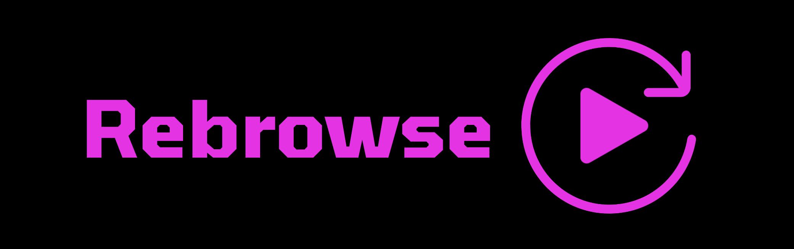
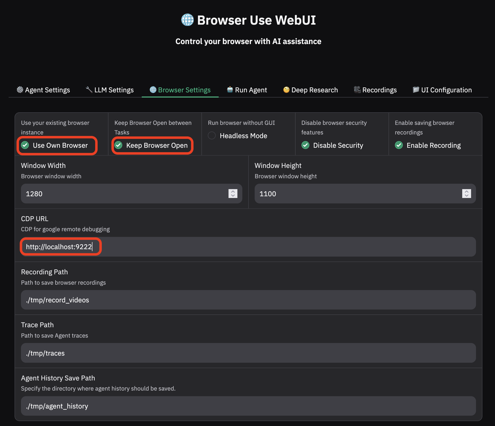

<br/>

[](https://x.com/n0rizkitty)

## About Rebrowse

Rebrowse is a powerful tool that allows you to record, automate, and share your AI workflows in one shot. It enables you to convert screen recordings into cross-app workflows, making it easier to document and reproduce complex AI interactions.

Key features of Rebrowse:
- Record your screen once and automate the workflow forever
- Transform recordings into shareable workflow agents
- Support for cross-application workflows
- Easy sharing and collaboration

Follow [me on twitter](https://x.com/n0rizkitty) to see the update!

---
## How to connect Browser Agent to your personal Chrome



### Custom Chrome Configuration

To allow the agent to use your personal Chrome browser, you need to start Chrome with specific flags. Here's how to do it:

1. First, identify your Chrome application path:
   - macOS: `/Applications/Google Chrome.app/Contents/MacOS/Google Chrome`
   - Windows: `C:\Program Files\Google\Chrome\Application\chrome.exe`
   - Linux: `/usr/bin/google-chrome`

2. Execute Chrome with the following flags:
```bash
# macOS example
/Applications/Google\ Chrome.app/Contents/MacOS/Google\ Chrome \
--remote-debugging-port=9222 \
--profile-directory=Default \
--no-first-run \
--no-default-browser-check \
--disable-features=IsolateOrigins,site-per-process \
--disable-web-security \
--disable-site-isolation-trials \
--disable-blink-features=AutomationControlled \
--disable-features=IsolateOrigins,site-per-process,LavaMoat \
--disable-extensions \
--disable-gpu \
--no-sandbox \
--disable-setuid-sandbox \
--disable-dev-shm-usage \
--disable-software-rasterizer \
--disable-features=BlockInsecurePrivateNetworkRequests \
--disable-features=CrossSiteDocumentBlockingIfIsolating \
--disable-features=CrossSiteDocumentBlockingAlways
```

These flags are necessary to:
- Enable remote debugging
- Disable security features that might interfere with automation
- Disable sandboxing and other restrictions
- Allow cross-origin requests
- Disable automation detection

---
This project builds upon the foundation of the [browser-use](https://github.com/browser-use/browser-use), which is designed to make websites accessible for AI agents.

We would like to officially thank [WarmShao](https://github.com/warmshao) for his contribution to this project.

**WebUI:** is built on Gradio and supports most of `browser-use` functionalities. This UI is designed to be user-friendly and enables easy interaction with the browser agent.

**Expanded LLM Support:** We've integrated support for various Large Language Models (LLMs), including: Google, OpenAI, Azure OpenAI, Anthropic, DeepSeek, Ollama etc. And we plan to add support for even more models in the future.

**Custom Browser Support:** You can use your own browser with our tool, eliminating the need to re-login to sites or deal with other authentication challenges. This feature also supports high-definition screen recording.

**Persistent Browser Sessions:** You can choose to keep the browser window open between AI tasks, allowing you to see the complete history and state of AI interactions.

<video src="https://github.com/user-attachments/assets/56bc7080-f2e3-4367-af22-6bf2245ff6cb" controls="controls">Your browser does not support playing this video!</video>

## Installation Guide

### Prerequisites
- Python 3.11 or higher
- Git (for cloning the repository)

### Option 1: Local Installation

Read the [quickstart guide](https://docs.browser-use.com/quickstart#prepare-the-environment) or follow the steps below to get started.

#### Step 1: Clone the Repository
```bash
git clone https://github.com/browser-use/web-ui.git
cd web-ui
```

#### Step 2: Set Up Python Environment
We recommend using [uv](https://docs.astral.sh/uv/) for managing the Python environment.

Using uv (recommended):
```bash
uv venv --python 3.11
```

Activate the virtual environment:
- Windows (Command Prompt):
```cmd
.venv\Scripts\activate
```
- Windows (PowerShell):
```powershell
.\.venv\Scripts\Activate.ps1
```
- macOS/Linux:
```bash
source .venv/bin/activate
```

#### Step 3: Install Dependencies
Install Python packages:
```bash
uv pip install -r requirements.txt
```

Install Browsers in Playwright:
You can install specific browsers by running:
```bash
playwright install --with-deps chromium
```

To install all browsers:
```bash
playwright install
```

#### Step 4: Configure Environment
1. Create a copy of the example environment file:
- Windows (Command Prompt):
```bash
copy .env.example .env
```
- macOS/Linux/Windows (PowerShell):
```bash
cp .env.example .env
```
2. Open `.env` in your preferred text editor and add your API keys and other settings

### Option 2: Docker Installation

#### Prerequisites
- Docker and Docker Compose installed
  - [Docker Desktop](https://www.docker.com/products/docker-desktop/) (For Windows/macOS)
  - [Docker Engine](https://docs.docker.com/engine/install/) and [Docker Compose](https://docs.docker.com/compose/install/) (For Linux)

#### Installation Steps
1. Clone the repository:
```bash
git clone https://github.com/browser-use/web-ui.git
cd web-ui
```

2. Create and configure environment file:
- Windows (Command Prompt):
```bash
copy .env.example .env
```
- macOS/Linux/Windows (PowerShell):
```bash
cp .env.example .env
```
Edit `.env` with your preferred text editor and add your API keys

3. Run with Docker:
```bash
# Build and start the container with default settings (browser closes after AI tasks)
docker compose up --build
```
```bash
# Or run with persistent browser (browser stays open between AI tasks)
CHROME_PERSISTENT_SESSION=true docker compose up --build
```


4. Access the Application:
- Web Interface: Open `http://localhost:7788` in your browser
- VNC Viewer (for watching browser interactions): Open `http://localhost:6080/vnc.html`